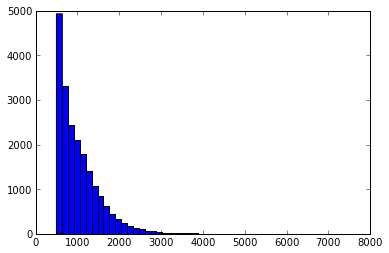
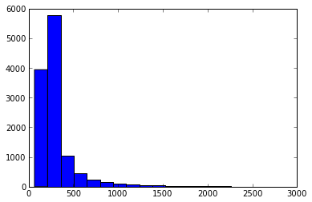

# Characteristion of transcriptomes of galaxiid fish

## Introduction

[Some stuff about why Galaxiids are great]

Rationale of this study - _G. brev_ as a high quality reference transcriptome that can be used to underpin future projects. _G. dep_ as a test case, lower coverage seqeuencing to examine genome-wide dNdS andisolate polymoprhic microsats. 

## Materials and methods

Before David

* Sample collection
* RNA extraction/normalisation
* Library prep
* Sequencing
* Assembly

David

* Annotation 
* Identfication of orthologs
* Identification of miscrosats
* Genome-wide dNdS

## Results

### Sequencing and assembly

Sequencing summary (needs fastq files)

* Number of reads
* Average read length
* Average quality scores

Assembly summary 

* G.brev
    + 20197 contigs > 700 bp
    + Median of 24 reads per contig
    + Median length of analysed contigs 886 bp
* G.dep
    + 11955 total contigs
    + Median 3 reads pre contig (mean = 10)
    + Median length of contigs 239

####Plots of lengths of each contig assembly

### Annotation

Rationale:
Have only performed functional annotation on _G. brev_ as it's the 
higehr quality sequence, and we only use _G. dep_ sequences that are 
presumed orthologss ot _G. brev_. We also identified ORFs and microsattelites
from both datasets. 

Results:
Haved Blasted agains NR and Swissprot. 

NR shows most hits coming from sensible taxonimc places (i.e. they are galaxiid
genes, not baceria/algae/whatever else)

`7525/21000` _G.brev_ contigs have hits against Swissprot. `3723` fror dep.

From these we harvested many many GO terms [summary]

Using `orffinder` and BLASTs agains chichlid, salmon, trout and zebrafish
abgenomes. Using these data we found `8727` ORFs in _G. brev_ and 4435 in _G. dep_

####summary

species     Total contigs   swissprot   NR  ORFs
----    
Gbrev       21000
Gdep        11000

### Identification of Orthologues

## Genome-wide analysis of selection

